<!-- ===================== HERO ===================== -->

<h1 align="center">👋 Yo! I'm <b>ReyzhCodes</b> ⚡</h1>

<i>Fullstack Developer • Bot Architect • Hosting Automation</i>

  

  
  

---

<!-- ===================== STATS ===================== -->

 

---

<!-- ===================== WHAT I BUILD ===================== -->

## 🔥 What I Build

```mermaid
graph TD
A[🤖 WhatsApp Bots<br/>Baileys + Node.js] --> B[🌐 Web Apps<br/>Laravel + PHP]
C[📱 Telegram Bots] --> D[💻 Discord Bots]
B --> E[☁️ Pterodactyl Panel<br/>API Automation]
D --> F[🔐 Auth & Payment<br/>Gateway Integration]
E --> G[⚙️ Full Automation<br/>Zero Repetition]
```

---

<!-- ===================== TECH STACK ===================== -->

## 🛠️ Tech Arsenal

  

---

<!-- ===================== SKILL TIMELINE ===================== -->

## 💻 Skill Timeline

---

<!-- ===================== ACTIVITY ===================== -->

## ⚡ GitHub Activity

  

---

<!-- ===================== CURRENT FOCUS ===================== -->

## 🌟 Currently Working On

* 🤖 Advanced **WhatsApp multi-device bots** (Baileys)
* ☁️ **Pterodactyl** automation & server provisioning
* 💳 **Payment Gateway** integration (Midtrans / Xendit)
* 🎨 **Laravel Dashboard** (Livewire / API-first)

---

<!-- ===================== COLLAB ===================== -->

## 📬 Let’s Collaborate

  
  
  

---

<!-- ===================== FOOTER ===================== -->

<b>"Build automation, not repetition. Code today, chill tomorrow."</b> ⚡🚀

