# 👋 Yo! I'm **ReyzhCodes** ⚡

  

🚀 **Fullstack Developer | Bot Architect | Hosting Automation Guru** dari 🇮🇩 Indonesia

---

---

## 🔥 What I Build

```mermaid
graph TD
A[🤖 WhatsApp Bots<br/>Baileys + Node.js] --> B[🌐 Web Apps<br/>Laravel + PHP]
C[📱 Telegram Bots] --> D[💻 Discord Bots]
B --> E[☁️ Pterodactyl Panel<br/>API Automation]
D --> F[🔐 Login Systems<br/>Payment Gateway]
E --> G[⚙️ Full Automation<br/>No Repetition]
```

---

## 🛠️ Tech Arsenal

  

---

## 💻 Skill Timeline

---

## 🔥 GitHub Activity

  

---

## 🌟 Currently Working On
- 🤖 Advanced WhatsApp multi-device bots
- ☁️ Pterodactyl automation & provisioning
- 💳 Payment gateway integration (Midtrans / Xendit)
- 🎨 Laravel dashboard (Livewire / API based)

---

## 📬 Let’s Collaborate

  
  
  

---

  

> **"Build automation, not repetition. Code today, chill tomorrow."** ⚡🚀
